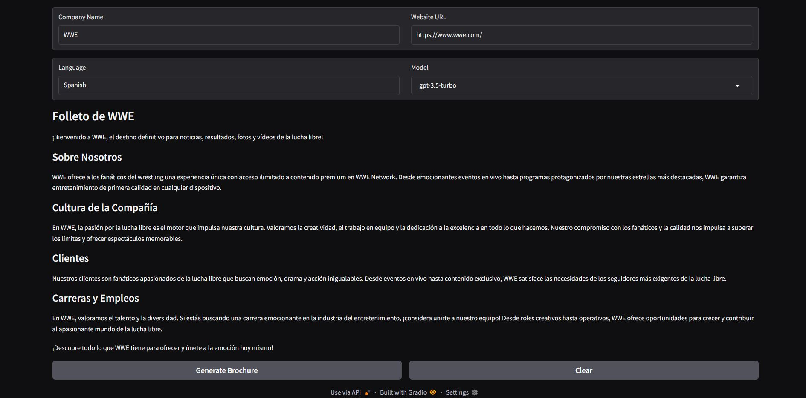
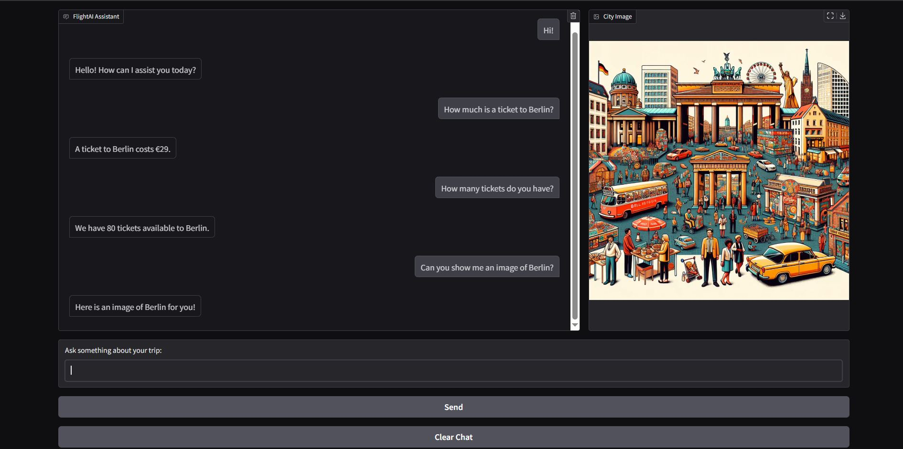
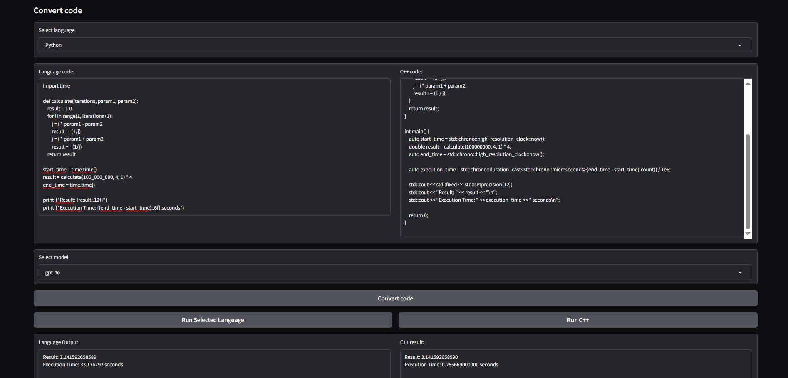
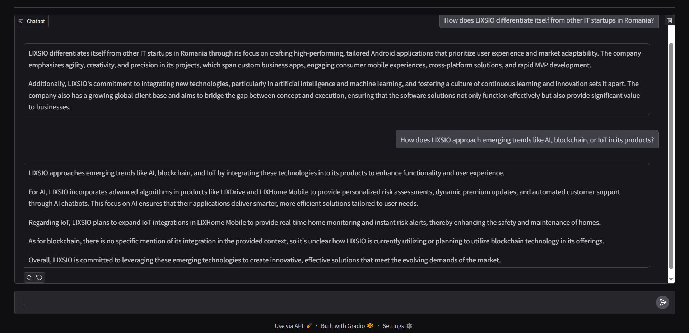

# 🚀 AI Projects Portfolio  

This repository contains **4 AI-powered projects**, each demonstrating different capabilities of **Large Language Models (LLMs)** and integrations with tools, APIs, and UIs.  
All projects use **Gradio** for interactive frontends and integrate with **OpenAI** / **Ollama** / **LangChain** as needed.

---

## 1️⃣ Proj1 — 🌐 AI Brochure Generator  
**Description:**  
Scrapes a company website, intelligently selects relevant pages (About, Careers, etc.), and generates a **beautiful brochure** in Markdown in any language.  

**Key Features:**
- 🌍 Web scraping with BeautifulSoup  
- 🤖 OpenAI GPT models & Ollama integration  
- 📜 JSON link filtering using LLM reasoning  
- 🎨 Gradio UI for easy interaction  

**Screenshot:**  

---

## 2️⃣ Proj2 — ✈️ FlightAI Assistant  
**Description:**  
A conversational assistant for an airline that:  
- Answers travel questions ✈️  
- Generates city images 🎨  
- Checks ticket prices 💰  
- Shows ticket availability 🎟️  

**Key Features:**
- 🛠️ Custom function calling tools (price, image, availability)  
- 🖼️ DALLE-3 city illustrations  
- 💬 Context-aware short replies  
- 📱 Gradio chat interface with image output  

**Screenshot:**  

---

## 3️⃣ Proj3 — 💻 Python/Cobol → C++ High-Performance Converter  
**Description:**  
Converts **Python or COBOL code** into **optimized C++** for maximum speed.  
Includes execution capabilities for both original and converted code.  

**Key Features:**
- 🔄 GPT-powered code translation  
- ⚡ High-performance C++ generation with `-Ofast`  
- ▶️ Built-in execution for Python, COBOL, and C++  
- 🖥️ Gradio UI for conversion & execution  

**Screenshot:**  

---

## 4️⃣ Proj4 — 📚 RAG AI Assistant with Chroma & LangChain  
**Description:**  
A **Retrieval-Augmented Generation (RAG)** assistant that answers questions using documents from a **knowledge base**.  
Includes 2D & 3D vector visualizations of embeddings.  

**Key Features:**
- 🧠 LangChain + Chroma vector DB integration  
- 📊 Plotly visualizations of embeddings (TSNE)  
- 💬 Conversational memory for context retention  
- 🖥️ Gradio chat interface  

**Screenshot:**  

---

## 🛠️ Tech Stack
- **Language:** Python 🐍  
- **Frameworks & Libraries:**  
  - Gradio, LangChain, BeautifulSoup  
  - OpenAI API, Ollama, ChromaDB  
  - Plotly, Matplotlib, Scikit-learn  

---

## 🎓 Credits  
These projects were developed as part of the course:  
**LLM Engineering: Master AI, Large Language Models & Agents**  
by **Ed Donner**  
